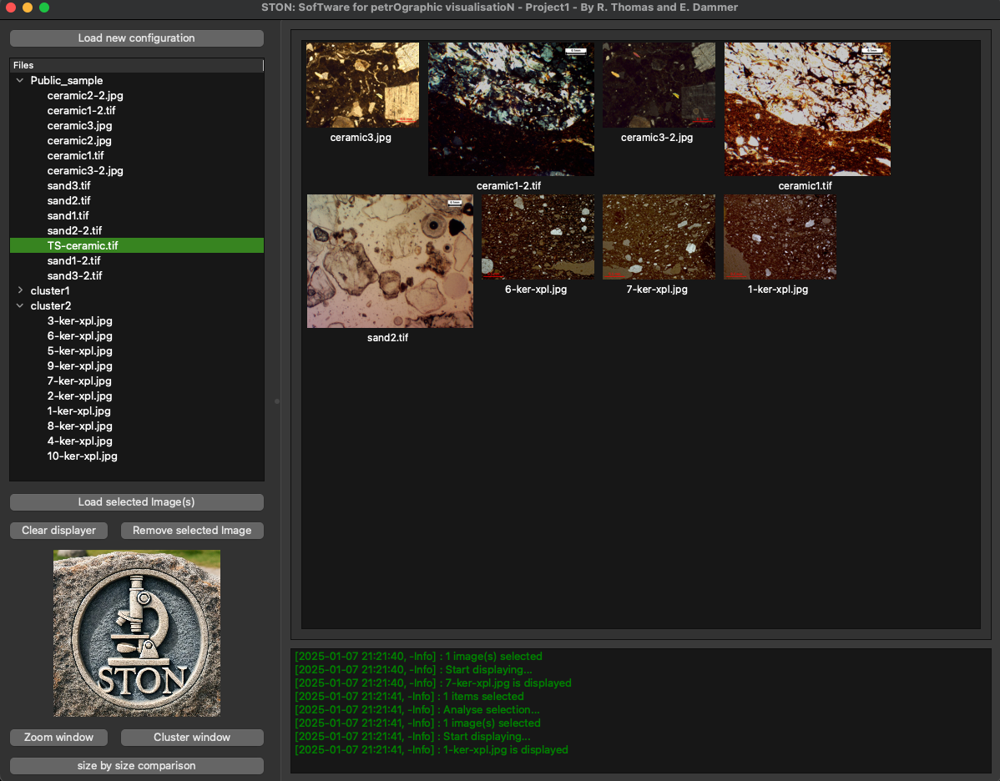

# Welcome to STON


<div align="center">

[](https://www.python.org/)

[](https://www.gnu.org/licenses/gpl-3.0)

</div>

---


Full documentation is available [here](https://romain-thomas-shef.github.io/STON/index.html).


## What is STON?

`STON` (SofTware for petrOgraphic visualisatioN) is a tool designed to simplify the inspection of microscope images. Originally developed for petrography, specifically for analyzing mineral images, it can be used with any type of image. STON allows users to closely examine images, adjust parameters (contrast, brightness, sharpness), compare images side by side, combine multiple images and analyse features.
Built with user-friendliness in mind, STON is fully customizable. It is developed in Python using the [PySide6](https://wiki.qt.io/Qt_for_Python) library for the GUI, [Pillow](https://pillow.readthedocs.io/en/stable/index.html) and [matplotlib](https://matplotlib.org/) for image display and interactions and [scikit-learn](https://scikit-learn.org/1.6/index.html) for deeper image processing.

While tailored for the specific requirements of petrographic analysis in archaeology, the software has broader applications for other research fields that rely on visual image analysis. By providing an efficient and scalable tool for comparative analysis, it enhances research processes across various disciplines. Designed to streamline researchers' work, STON provides a comprehensive suite of tools for image analysis and visual inspection. It offers a user-friendly interface and visualization features, STON simplifies the process of inspecting, comparing, and manipulating images. All these tools are accessible from the main window, enabling users to explore images in greater detail, extract meaningful insights, and conduct in-depth analyses with ease.

---

## The graphical interface

<p align="center">

</p>

STON is a graphical user interface consisting of a main window and multiple sub-windows for performing specific tasks. The main window serves as a central platform where images are loaded from disk and displayed as thumbnails.

- Image detail and note-taking window: This window allows the user to inspect an image in greater detail. It also displays image metadata (currently supported for .tif files only) and provides options to adjust color, sharpness,
 brightness, and contrast. Additionally, it includes access to the analysis tool, enabling users to identify and study specific regions of interest.

- Side-by-Side Comparison Tool: Allows users to directly compare two images, making it easier to identify differences or similarities between samples. This feature is particularly useful in petrography and other disciplines where visual distinctions play a crucial role during the analysis.

- Image Cluster Tool: Facilitates the creation of image mashups by combining multiple images into a single composite. This is especially useful for merging images of the same material sample to create a unified visualization. Additionally, it supports the generation of meta-images, where all selected images are compiled into one comprehensive view, helping researchers analyze patterns and relationships across multiple images.

## Feature identification

STON offers a fast and eqsy-to-use analysis tool for identifying regions of interest within an image. The underlying algorithm is based on the [measure module](https://scikit-image.org/docs/stable/api/skimage.measure.html) from the scikit-image library. It defines a region as a group of connected pixels sharing the same value. To account for pixel-to-pixel variations in the image, STON generates a binary image using a threshold set at the image’s average.

Users can then inspect all detected regions simultaneously or examine them individually. Additionally, a catalog of region properties can be downloaded for further analysis.

## Installation
For the moment, STON is available on the test server of Pypi. You can install it using the following command:

```python -m pip install --extra-index-url https://test.pypi.org/simple/ STON```

---

**Contribute!** STON is not perfect! If you have any comment or anything you would like to be added to STON, or, even better, if you want to modify you can 

- create an issue at https://github.com/Romain-Thomas-Shef/STON/issues
- [make a fork of the source code on github](https://github.com/Romain-Thomas-Shef/STON/fork), implement the changes and [open a PR](https://docs.github.com/en/pull-requests/collaborating-with-pull-requests/proposing-changes-to-your-work-with-pull-requests/creating-a-pull-request-from-a-fork)
- contact us via mail! ---> romain.thomas@sheffield.ac.uk & dammer.evgenia@gmail.com

To implement your changes, the [*Development corner* in the docs](https://romain-thomas-shef.github.io/STON/dev_notes.html) might give you further information and we are happy to help if you get in touch with us!

---

### License

STON is a free software: you can redistribute it and/or modify it under the terms of the GNU General Public License as published by the Free Software Foundation, version 3 of the License.
