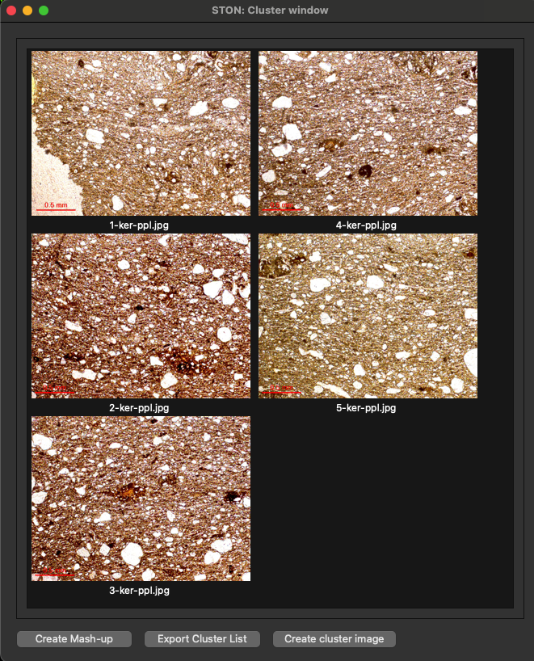
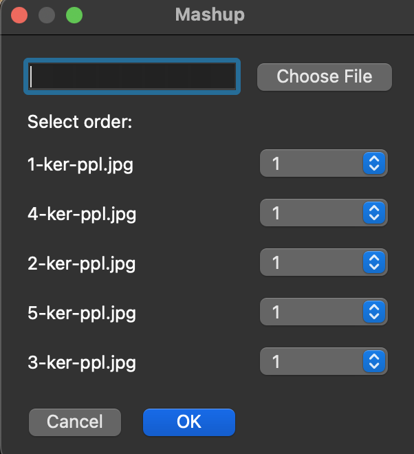

Grouping images
===============

The cluster window allows you to group images together and perform a few operation on the image group. From the main window display area, choose a few images and click *cluster window*.
When opened, it will display the selected images:

   Cluster window

The cluster window will show the group of images as they were displayed in the main window of STON. At the bottom, three buttons are available:

   Mashup pop-up window

* **Create mashup**: This will combine all images into one. This is particularly useful when the images are coming from the same sample (see image below on the left). The order in which the images are organised is decided by a pop-up window (see left). It will ask you to select the position of each image from 1 (most left image) to N (N=number of images in the cluster, most right image). It will also ask you an image name. You can click on *choose* to open the iamge explorer. 

* **Create cluster image**: This will create a general image of all the image in the cluster (see image below, on the right). You can tune the parameter of the final image in the configuration file (see :doc:`get_started`). STON will ask you for the name of the final image.

* **Explore cluster list**: This will create a file with the list of all images. STON will ask you where to save the file.

.. figure:: images/cluster_window/example.png
   :width: 700
   :align: center

   Mashup (left) and Meta image (right).
