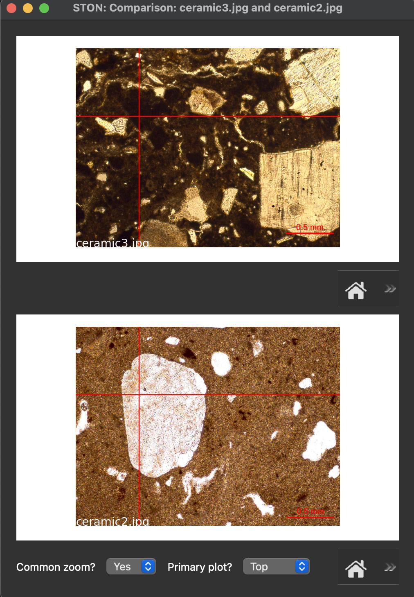
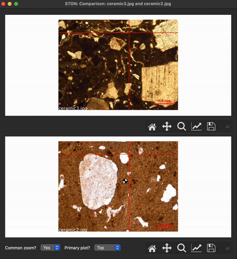

Compare images
==============

The comparison window allows you to compare two images.

   Comparison window

The comparison window is composed of the two plots (red & yellow boxes on the screenshot above). For each plot a toolbar is available under each plot on the right. On each of this toolbar, clicking on the lense window allow you to zoom in the corresponding plot.

You will notice that a red crosshair is displayed on each plot and always point at the same position on the two plots. It will follow your mouse position.

At the bottom of the window, on the left, the zoom setup is available, with two dropdown lists: one to choose if the common zoom is activated (it is by default), the other to choose which primary plot is selected (the top is by default).

   Zoom setup

Zoom setup
----------

Two zoom configuration are available:

* Common zoom = Yes: It the common zoom is set to 'yes', using the lense on the selected 'primary' plot will zoom it and also the secondary plot.

* Common zoom = No: In that case, zoom will be independant from eachother.

You can choose which plot is considered the 'primary' one using the 'primary plot' dropdown list.

You can see how it works on the video on the left.
