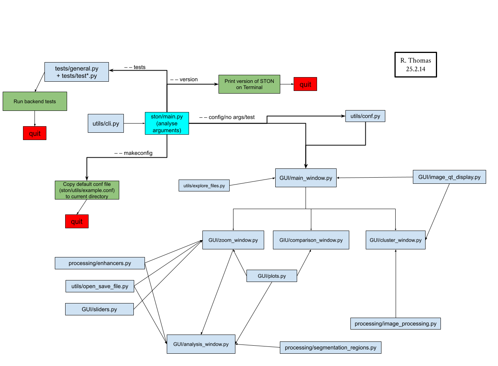

Development corner
==================

Git repo structure
------------------

STON is stored in `github <https://github.com/Romain-Thomas-Shef/STON>`_. The structure of the repository is the following:

.. code-block:: shell

     STON/
     ├── docs/
     │   ├── build/
     │   ├── index.html
     │   ├── make.bat
     │   ├── Makefile
     │   └── source/  # where to edit the documentation
     ├── LICENCE.txt
     ├── pyproject.toml # Python Packaging configuration file
     ├── README.md  # github README
     ├── ston/ # Where the source code is
     ├── test/ # Where the tests are

If you want to edit the source code you must go in the subdirectory called **ston**. The documentation can be edited under **docs/source**.

Source code flow
----------------

To understand a bit how the structure of the code works you can look at the picture below.

   Source code flow

The *pyproject.toml* file includes the ``[project.gui-scripts]`` section with ``ston="ston.main:main"``. This means that when you start STON with the ``ston`` command it will go directly in the *main.py* file starting the ``main()`` function. 
This function is parsing the command line interface argument that were given by the user. Depending on these, STON will do multiple actions:

- Create an empty configuration file (``makeconfig``). This is done directly in the *main.py* function.
- Display the version of STON (``--version``).
- Start the main window (``--config`` or no arguments at all). This will extract first a configuration (done in *conf.py*):

  - If no argument was passed, a default configuration will be given,
  - if a configuration is passed, it is read and extracted.

Once a configuration is ready, the ``main()`` function calls the ``GUI()`` class from *main_windows.py* file. This is where the main window is coded. This code is calling various local modules: 

- The other windows:
  
  - *zoom_window.py*: This is where the window with an image, header diplayer and live zoom window is displayed
  - *comparison_window.py*: where two images can be viewed side by side.
  - *cluster_window.py*: where multiple images can be grouped.
 
- *explore_files.py*: where we find files in the disk
- *image_processing.py*: where the images are modified for display.

The content of ``ston/`` is visible below:

.. code-block:: shell

        ston
        ├── cli.py
        ├── cluster_window.py
        ├── comparison_window.py
        ├── conf.py
        ├── example.conf
        ├── explore_files.py
        ├── image_processing.py
        ├── __init__.py
        ├── main.py
        ├── main_window.py
        ├── __pycache__/ 
        ├── pylintrc
        ├── template_file
        └── zoom_window.py

You can see that extra files/directories are available:

* *pylintrc*: this is the pylint configuration file for STON.
* *template_file*: This is a file with just a header. To start a new source code file.
* *example.conf*: This is the generic configuration file used by the ``--makeconfig`` argument. 
* **__pycache__**: Where the compiled python code is stored (this is NOT to be touched).

Documentation
-------------

.. note::

   If you want to edit the documentation, you will need to install ``sphinx`` and ``sphinx-rtd-theme``. 

All the documentation is written in **docs/**. To edit it you need to go to source and edit the file you want to modify. Everything is written in `reStructuredText <https://www.sphinx-doc.org/en/master/usage/restructuredtext/index.html>`_ markup language. 

Once modified, go to **docs/** and run ``make clean && make html`` in the terminal. This will erase the previous version and create a new version of the documentation with your modifications.

.. danger:: 

   To be able to update the github documentation, you need to compile it first in your disk and then push everything in the repo.
