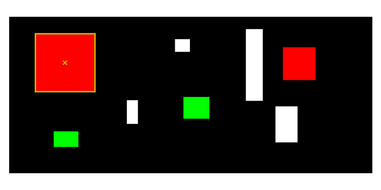
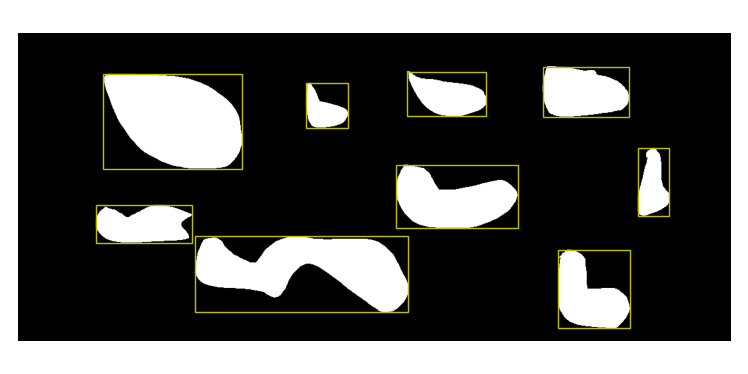

Testing STON
============

STON can be tested *relatively* easily. STON development fully separated the GUI from the back-end functions.
You can test both separately. 

Back-end functions
------------------
To test the backend part of STON you need to use the terminal and the command line interface (see :doc:`get_started`)::

    [me@mymachine]: ston --test

Here it will ask you what you want to test::

    [me@mymachine]: ston --test
    What test do you want to run?
    [utils/processing/segmentation, just press enter for all]:

You can either press enter for the full test suite or write `utils` or `processing` to test some parts only. 
This part of the testing uses the ``unittest`` module, part of the standard library.

You can also use ``pytest``. For this you must go to the installation directory of STON and run ``pytest ston/tests/``.

A few details:

* ``utils``: This will test everything that deals with finding files, saving/opening txt files, reading configuration.
* ``processing``: This will test everything that deal with images creation (mashup, metaimage, etc). 
* ``segmentation``: This will test the region identification.

Graphical Interface
-------------------

We did not write unittests for the graphical interface. Instead we have stored *test data* in the package and you can follow the following procedure to test the main functionalities of the interface. The STON documentation has been written with these test_data so you can actually follow the documentation and test the tool at the same time. 

To start the GUI in test mode just use the following command::

    [me@mymachine]: ston --config test

When starting, STON will start two windows: the :doc:`main_window` and the :doc:`zoom_window` window.

Main window
^^^^^^^^^^^

The :doc:`main_window` should give you access to the following data (on the left file explorer):

* singletif --> 1 image
* logo --> 1 image 
* cluster1_1sthalf --> 5 images
* dummy_analysis --> 2 images
* 3rd_level --> 4 images
* cluster2 --> 10 images
* cluster1_2ndhalf --> 5 images

If you deploy the *3rd_level* directory, and double click on **ceramic3.jpg** and **ceramic2.jpg**, images will be displayed on the right part of the window. You should have the following window at this point:

.. figure:: /images/GUI/test_GUI_main_window.png
   :width: 700
   :align: center

   Main window of STON with **ceramic3.jpg** and **ceramic2.jpg** open on the display area

Zoom window
^^^^^^^^^^^

If you double click on **ceramic3.jpg** in the image area, you can go to the second window (the detail window), you should see this:

.. figure:: /images/GUI/test_GUI_detail_window.png
   :width: 700
   :align: center

   Detail window on the with **ceramic3.jpg** image loaded.

Passing the mouse over the image, you will see the closeup window on the bottom left showing a zoom in part of the region where mouse is (see the short video in :doc:`zoom_window`). You can see that there are already some notes on the notepad. These are the notes displayed for testing purpose. You might modify this notes and save them back (**Note:** it will be saved only if the directory where ston is installed is available with write rights).
As the image is a *jpg*, there is not metadata associated with it. If you want to check that the header display is working, you can load the image **singletif/TS-ceramic.tif** and you will see the following header::

    ImageWidth           	4744,
    ImageLength          	1048,
    BitsPerSample        	8, 8, 8
    Compression          	1,
    PhotometricInterp    	2,
    StripOffsets         	240,
    SamplesPerPixel      	3,
    RowsPerStrip         	1048,
    StripByteCounts      	14915136,
    MinSampleValue       	0,
    MaxSampleValue       	255,
    XResolution          	2400, 1,
    YResolution          	2400, 1,
    PlanarConfigurati    	1,
    ResolutionUnit       	2,
    PageNumber           	0, 0
    NewSubfileType       	0,

And the following image:

.. figure:: /images/zoom_window/testwithtif.png
   :width: 700
   :align: center

   Zoom window with header display

As described in :doc:`zoom_window`, you can adjust the enhancers (color, contrast, etc) to change the property of the image.

Cluster window
^^^^^^^^^^^^^^

If you load all the images under the directory *cluster1_1sthalf* you can then open the cluster window. You will find yourself in the same setup as in the :doc:`cluster_window`, with the exact same images. To create a mashup image, you need to select the order in which the images will be associated. Follow the image names and you will get the same mashup as in :doc:`cluster_window`. 

Side by side comparison
^^^^^^^^^^^^^^^^^^^^^^^
If you select  **ceramic3.jpg** and **ceramic2.jpg** and click on size-by-size comparison, you will have the corresponding window appearing. The page :doc:`comparison_window` shows you how to change the zoom with a small video.

Analysis window
^^^^^^^^^^^^^^^

To test that the Analysis tool works correctly you can load the two images under **dummy_analysis**. These images are made-up images that are made of artificial shapes (colored or white) on a black background.
If you load them in the analysis tool you and run the region identification (without any filtering or cropping), you should see these two region indentifications:

   test_segmentation Region explorer panel.

For **test_segmentation**, all shapes are squares or rectangle so you might not see the boxes around the shapes. But you should get the following statistics::

    Region identification (look at corresponfing panel):
    Ratio of black regions [%]: 86.0
    Ratio of white regions [%]: 14.0
    Number of regions identified: 8
    Smallest region: 1794.0 pixels
    Largest region: 32757.0 pixels 

For the second image (**test_segmentation2**). shapes are not squared and you should see the following:

   test_segmentation2 All regions panel.

In addition, the information on region identification should give you::

    Region identification (look at corresponfing panel):
    Ratio of black regions [%]: 83.0
    Ratio of white regions [%]: 17.0
    Number of regions identified: 9
    Smallest region: 2544.0 pixels
    Largest region: 23835.0 pixels
