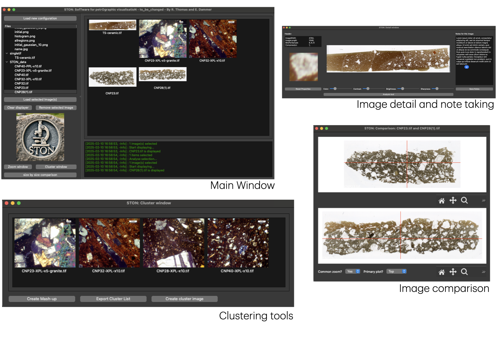
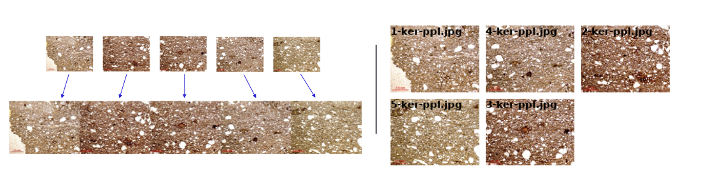
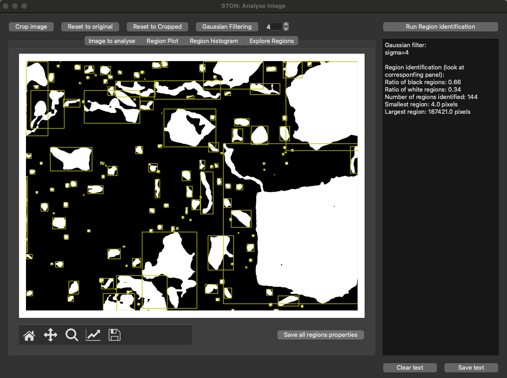

# Summary

`STON` (SofTware for petrOgraphic visualisatioN) is a tool designed to simplify the inspection of microscope images. Originally developed for petrography, specifically for analyzing mineral images, it can be used with any type of image. STON allows users to closely examine images, adjust parameters (contrast, brightness, sharpness), compare images side by side, combine multiple images and analyse features.
Built with user-friendliness in mind, STON is fully customizable. It is developed in Python using the [PySide6](https://wiki.qt.io/Qt_for_Python) library for the GUI, Pillow [@Murray:2025] and matplotlib [@Hunter:2007] for image display and operation, and scikit-image [@vanderwalt:2014] for deeper image processing. 

# Statement of need

Thin-section petrography is a widely used technique in archaeology for analyzing the composition of ceramic and stone objects, as well as investigating their production technology and provenance [@Reedy:2008; @Peterson:2009; @Quinn:2022]. This method involves studying these materials in thin sections mounted on glass slides under a polarizing microscope to examine their microscopic features. A critical aspect of archaeological study is the comparison and identification of patterns within these features across multiple samples. However, it is typically only possible to view one sample at a time under the microscope. As a result, this method relies heavily on visual memory and repeated observations, making the process inefficient and time-consuming, particularly when dealing with hundreds of samples.

This tool is designed to address these challenges by enabling users to observe multiple photomicrographs simultaneously within a single, convenient interface. It facilitates detailed comparisons, clustering, and data recording, which is especially important in ceramic paste analysis. By allowing users to view multiple samples side by side, the software supports efficient sample grouping and evaluation of compositional characteristics.

While tailored for the specific requirements of petrographic analysis in archaeology, the software has broader applications in other research fields that rely on visual image analysis. By providing an efficient and scalable tool for comparative analysis, it enhances research processes across various disciplines.

# The graphical user interface

STON is a graphical user interface consisting of a main window (see \autoref{fig:GUI}) and multiple sub-windows for performing specific tasks. The main window serves as a central platform where images are loaded from disk and displayed as thumbnails.

Designed to streamline researchers' work, STON provides a comprehensive suite of tools for image analysis and visual inspection.
It offers a user-friendly interface and visualization features, STON simplifies the process of inspecting, comparing, and manipulating images.
All these tools are accessible from the main window, enabling users to explore images in greater detail, extract meaningful insights, and conduct in-depth analyses with ease.

- Image detail and note-taking window: This window allows the user to inspect an image in greater detail. It also displays image metadata (currently supported for .tif files only) and provides options to adjust color, sharpness, brightness, and contrast. Additionally, it includes access to the analysis tool (see next section), enabling users to identify and study specific regions of interest.
- Side-by-Side Comparison Tool: Allows users to directly compare two images, making it easier to identify differences or similarities between samples. This feature is particularly useful in petrography and other disciplines where visual distinctions play a crucial role during the analysis.
- Image Cluster Tool (see \autoref{fig:cluster}): Facilitates the creation of image mashups by combining multiple images into a single composite. This is especially useful for merging images of the same material sample to create a unified visualization.
Additionally, it supports the generation of meta-images, where all selected images are compiled into one comprehensive view, helping researchers analyze patterns and relationships across multiple images.

## Feature identification

STON offers a fast and easy-to-use analysis tool for identifying regions of interest within an image. The underlying algorithm is based on the [measure module](https://scikit-image.org/docs/stable/api/skimage.measure.html) from the scikit-image library. It defines a region as a group of connected pixels sharing the same value. To account for pixel-to-pixel variations in the image, STON generates a binary image using a threshold set at the image’s average. 

Users can then inspect all detected regions simultaneously (see \autoref{fig:regions}) or examine them individually. Additionally, a catalog of region properties can be downloaded for further analysis.

# Acknowledgements

This work was generously supported by the Gerda Henkel Foundation. E. D. would like to thank Dr. Dennis Braekmans (Leiden University) for his feedback and advice on optimisation for archaeological research. R. T. would like to thank Peter Heywood, Edwin Brown and Neil Shephard for their advices during the development of the tool.

# References
